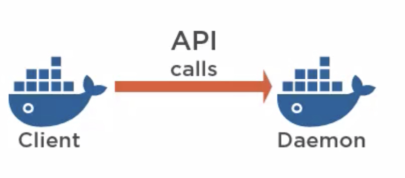

# Docker

[Official Docker Site](https://www.docker.com/)

> an open platform for developers and sysadmins to build, ship, and run distributed applications"

Docker allows you to run containers. A **container** is a sandboxed process running an application and its dependencies on the host operating system. The application running inside the container considers itself to be **the only process running on the machine** while the machine can run multiple containers independently.

In order to get started with docker you first need to create a `Dockerfile` for building your sandboxed application. [See the example](Dockerfile). Additionally, you might also need to create a `.dockerignore` file, [here's an example of one](.dockerignore).

## List of useful commands

- Search an image in docker hub:
  - **`docker search <name>`**
- Show useful information about the docker installation on the current machine:
  - **`docker version`**
- Display a bunch of information about your docker images, containers and more:
  - **`docker info`**
- Build image from the current directory specs:
  - **`docker build -t <id>:<version> .`**
- Log into the docker image shell (in this case the ubuntu image):
  - **`docker run -it ubuntu bash`**
- Run image:
  - `-d` tells docker to run on daemon mode.
  - `--name` is used to set a short identifier for YOU
  - `-p` is used to map network ports

#### `docker run -d --name <id> -p <HOST_PORT>:<CONTAINER_PORT> <which image to use>:<don't forget the version>`

- List all running(or that were running) images:
  - **`docker ps -a`**
- Get details about a running container, such as IP address:
  - **`docker inspect <friendly-name|container-id>`**
- To see the logs of a container:
  - **`docker logs <friendly-name|container-id>`**
- List images:
  - **`docker images`**
- Stop a running image:
  - **`docker stop <container id>`**
- Stop all running images:
  - **`docker stop $(docker ps -aq)`**
- Remove all running/previously ran images
  - **`docker rm $(docker ps -aq)`**
- Remove an image
  - **`docker rmi <image name>`**
- Remove all images
  - **`docker rmi $(docker images -q)`**
- To download images from Docker Hub:
  - **`docker pull <name of image>`**

Under the hood, whenever you run any of these commands the docker client is making API calls to the docker daemon aka docker engine.



## Some lingo

**Images**: blueprint of containers

**Containers**: running images

## Stateful Containers

By default containers are stateless, meaning that once they shutdown and start again they start fresh with no memory of what had occurred in the previos running instance. However, containers have been optimized to be able to persis data and become stateful. In order to persist data you will need to read the documentation on docker hub about the ways to map your container storage to the host storage. Typically you would use a command like this:

#### `docker run -d --name mongoSample -v /opt/docker/data/mongo:/data/db mongo:latest`

## The Dockerfile

**`FROM <image>:<tag>`** allows you to start a container from an existing image in the docker hub registry. Its recommended that the tag `latest` be avoided and instead define the exact version you want to use and update as you go.

**`WORKDIR <directory path>`** stablishes where all future commands will be executed

**`RUN <command>`** allows you to execute a command as you would in a terminal. The results after running the `RUN` command are persisted to the image.

**`COPY <src> <dest>`** allows you to copy files from the host machine to the container's image.

**`EXPOSE <port>`** here you tell Docker which ports should be open and can be bound to. You can define a single port, multiple ports, and a range of ports. Examples:

- `EXPOSE 8080`
- `EXPOSE 8080 5000 3000`
- `EXPOSE 7000-8000`

**`CMD ["npm", "start"] | <some single-word command>`** in a Dockerfile defines the default command to run when a container is launched.

## Environment Variables

With Docker, environment variables can be set the moment you launch a container. Using the `-e` option you can define those env variables like this: **`docker run -d --name production-react-app -e NODE_ENV=production ...`**

## OnBuild optimization

Docker executes commands from top to bottom but there are prefixes that can alter this behavior. One of these prefixes is **`ONBUILD`**.

Generally it would be something like this:

```dockerfile
FROM node:10
RUN mkdir -p /usr/src/app
WORKDIR /usr/src/app
ONBUILD COPY package.json /usr/src/app
ONBUILD RUN npm install
ONBUILD COPY . /usr/src/app
CMD [ "npm", "start" ]
```

In shorter versions you can even work with something like this which will accomplish the same from above:
:warning: This is deprecated

```dockerfile
FROM node:10-onbuild
EXPOSE 3000
```

## Proper Native Clustering with Swarm

**Note:** this is totally a opt feature

A collection of dockers engines joined into a cluster is called a **Swarm**. Then, the docker engines running on each node inside the swarm are said to be running in **Swarm Mode**.

**Manager nodes** maintain the swarm. It is recommended to have an odd number of them, 3 or 5.

In order to run **services** you need to be running your containers in swarm mode. A service is a declarative way of running and scaling tasks.

For example, if I was to deploy 2 microservices one for backend storage and another one for frontend. If I wanted to tell docker that I want 3 instances of the container running the frontend always running I would execute a command like this:

#### `docker service create --name web-frontend --replicas 5`

To start a swarm:

#### `docker swarm init`

but sometimes you are better off specifying an advertised(exposed) ip address as well as a listen:

#### `docker swarm init --advertise-addr 127.0.0.0:2377 --listen-addr 127.0.0.0:2377`

**Important ports**

- Engine port: 2375
- Secure engine port: 2376
- Swarm port: 2377 (not officially yet)

## Pro tips

- By default, the port on the host is mapped to 0.0.0.0, which means all IP addresses. You can specify a particular IP address when you define the port mapping, for example, `-p 127.0.0.1:6379:6379` - Katacoda
